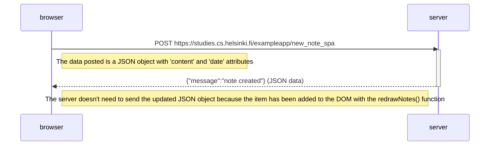

```mermaid
sequenceDiagram
    participant browser
    participant server

    browser->>server: POST https://studies.cs.helsinki.fi/exampleapp/new_note_spa
    activate server

    Note right of browser: The data posted is a JSON object with 'content' and 'date' attributes

    server-->>browser: {"message":"note created"} (JSON data)
    deactivate server

    Note right of browser: The server doesn't need to send the updated JSON object because the item has been added to the DOM with the redrawNotes() function

```